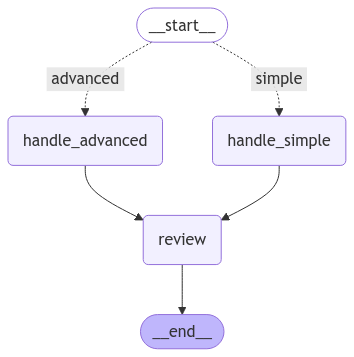

# LangGraph Query Router

This example demonstrates a multi-agent graph which utilizes an LLM within a query router to determine where to route
a user query. Depending on the complexity of the user query, it will route to either a simple model or an advanced model.

The purpose of this repository is to demonstrate a simple graph with multiple agents & a conditional edge. It is by no 
means production ready, or capable of handling "real" requests, the prompts for the `handle_advanced` and `handle_simple`
instruct the LLMs to pretend to answer the original query.



> A visual representation of the graph

## Requirements

1. Install Python (compatible version required, e.g., 3.x)
2. Install dependencies:
   ```bash
   pip install -r requirements.txt
   ```
3. Configure your environment:
    - Copy the example config file:
      ```bash
      cp ./config/config-example.yml ./config/config.yml
      ```
    - Add your API keys and update model configurations in `config.yml`.

## Running the Example

To run the application:

1. Execute the main entry point:
   ```bash
   python app.py
   ```
2. The application uses two hardcoded queries:
    - One routed to the **advanced model**
    - Another routed to the **simple model**

## Visualizing the Graph

Included in the `src` dir is a utility script `generate_diagram.py` which can be executed to generate a png visualizing 
the graph within this application. This script was used to generate the visualization above.

```bash
python generate_diagram.py
```

## Notes

- This repository is intended for educational purposes and quick prototyping.
- See class level docstrings within `./core/language_models.py` for limitations with the current language model manager.